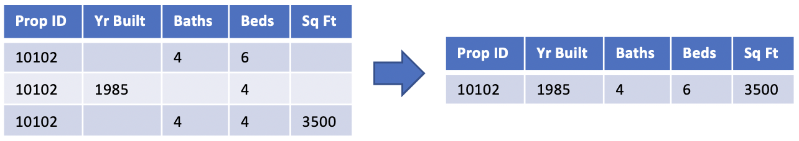

```{r, include=FALSE}
knitr::opts_chunk$set(
  eval=FALSE
)
```

------------------------------------------------------------------------



Administrative data records like real estate tax records have, by their nature, multiple entries over time of information related to some entity. For example, for a single property parcel there will be a separate entry for each sale that has occurred. However, it is rare for all pertinent information to be fully entered every time. For example, the number of bedrooms may be consistently entered when a sale occurs, but possibly not again when a record is entered for recording annual property tax not associated with a sale. Also, values can change over time from record to record (e.g property additions change the number of bedrooms). Also, it is reasonable to expect that the entries will not always be accurate (misspellings, transpositions, etc).

For real estate tax records it is reasonable to assume that the most recent entry is the most probably valid entry (e.g. number of bedrooms recently recorded will be more accurate than number of bedrooms recorded before an addition was added to the house). However, **the most recent record will not necessarily have all of the needed information** (see previous paragraph). Therefore, for each unique real estate parcel, we need to get the **latest recorded value for each item/variable** we are interested in using.

Accordingly, we create a [unique id table with a single record for each parcel]{.ul} and [individual tables for each item/variable]{.ul} (number of bedrooms, number of bathrooms, living square footage, etc.). These are then all joined to create a table of just the **latest recorded information for each item/variable for each unique parcel**.

## Load libraries and functions

```{r}
# {r}
source("../R/functions.R")
library(glue)
```

### Create a function to build the SQL queries necessary to get most recent item recordings

```{r}
# {r}
build_latest_query <- function(col_name) {
  tbl <- glue("current_tax_200627_latest_{col_name}")
  glue_sql("
        DROP TABLE IF EXISTS corelogic_usda.{`tbl`};
        
        SELECT geoid_cnty, 
           p_id_iris_frmtd, 
           {`col_name`}
        INTO corelogic_usda.{`tbl`}
        FROM
        (
          SELECT geoid_cnty, 
                 p_id_iris_frmtd, 
                 {`col_name`},
                 sale_date,
                 ROW_NUMBER() OVER (PARTITION BY geoid_cnty, p_id_iris_frmtd ORDER BY sale_date DESC) as rec_num
          FROM corelogic_usda.current_tax_200627_typed
          WHERE sale_date IS NOT NULL
          AND p_id_iris_frmtd IS NOT NULL
          AND {`col_name`} IS NOT NULL
        ) t
        WHERE rec_num = 1;
        
        ALTER TABLE corelogic_usda.{`tbl`} ADD PRIMARY KEY (geoid_cnty, p_id_iris_frmtd);
           ", .con = con)
}
```

## Create Unique ID Table

```{sql}
-- {sql} * Run In psql/pgcli
SELECT DISTINCT geoid_cnty, p_id_iris_frmtd
INTO corelogic_usda.current_tax_200627_unique_id
FROM corelogic_usda.current_tax_200627_typed
WHERE geoid_cnty IS NOT NULL
AND p_id_iris_frmtd IS NOT NULL;

ALTER TABLE corelogic_usda.current_tax_200627_unique_id ADD PRIMARY KEY (geoid_cnty, p_id_iris_frmtd);
```

### Run build_latest_query for each column, then copy the SQL into psql/pgcli

```{r}
# {r}
build_latest_query("property_indicator")
```

```{r}
# {r}
build_latest_query("acres")
```

```{r}
# {r}
build_latest_query("land_square_footage")
```

```{r}
# {r}
build_latest_query("bldg_code")
```

```{r}
# {r}
build_latest_query("building_square_feet")
```

```{r}
# {r}
build_latest_query("living_square_feet")
```

```{r}
# {r}
build_latest_query("year_built")
```

```{r}
# {r}
build_latest_query("effective_year_built")
```

```{r}
# {r}
build_latest_query("bedrooms")
```

```{r}
# {r}
build_latest_query("full_baths")
```

```{r}
# {r}
build_latest_query("qtr_baths")
```

```{r}
# {r}
build_latest_query("thrqtr_baths")
```

```{r}
# {r}
build_latest_query("half_baths")
```

```{r}
# {r}
build_latest_query("total_baths")
```

```{r}
# {r}
build_latest_query("situs_address")
```

```{r}
# {r}
build_latest_query("mail_address")
```

```{r}
# {r}
build_latest_query("sale_code")
```

```{r}
# {r}
build_latest_query("sale_price")
```

```{r}
# {r}
build_latest_query("sale_date")
```

```{r}
# {r}
build_latest_query("recording_date")
```

```{r}
# {r}
build_latest_query("transaction_type")
```

```{r}
# {r}
build_latest_query("tax_year")
```

```{r}
# {r}
build_latest_query("property_centroid_longitude")
```

```{r}
# {r}
build_latest_query("property_centroid_latitude")
```

## Create Table of All Latest Information

```{sql}
-- {sql} * Run In psql/pgcli
SELECT a.geoid_cnty, a.p_id_iris_frmtd,
      acres, land_square_footage, bldg_code, building_square_feet, living_square_feet,
      year_built, effective_year_built, bedrooms, full_baths, qtr_baths, thrqtr_baths,
      half_baths, total_baths, situs_address, mail_address, sale_code, sale_price,
      sale_date, recording_date, transaction_type, tax_year
 INTO corelogic_usda.current_tax_200627_latest_all
 FROM corelogic_usda.current_tax_200627_unique_id a
 LEFT JOIN corelogic_usda.current_tax_200627_latest_acres b
   ON a.geoid_cnty = b.geoid_cnty AND a.p_id_iris_frmtd = b.p_id_iris_frmtd
 LEFT JOIN corelogic_usda.current_tax_200627_latest_land_square_footage c
   ON a.geoid_cnty = c.geoid_cnty AND a.p_id_iris_frmtd = c.p_id_iris_frmtd
 LEFT JOIN corelogic_usda.current_tax_200627_latest_bldg_code d
   ON a.geoid_cnty = d.geoid_cnty AND a.p_id_iris_frmtd = d.p_id_iris_frmtd
 LEFT JOIN corelogic_usda.current_tax_200627_latest_building_square_feet e
   ON a.geoid_cnty = e.geoid_cnty AND a.p_id_iris_frmtd = e.p_id_iris_frmtd
 LEFT JOIN corelogic_usda.current_tax_200627_latest_living_square_feet f
   ON a.geoid_cnty = f.geoid_cnty AND a.p_id_iris_frmtd = f.p_id_iris_frmtd
 LEFT JOIN corelogic_usda.current_tax_200627_latest_year_built g
   ON a.geoid_cnty = g.geoid_cnty AND a.p_id_iris_frmtd = g.p_id_iris_frmtd
 LEFT JOIN corelogic_usda.current_tax_200627_latest_effective_year_built h
   ON a.geoid_cnty = h.geoid_cnty AND a.p_id_iris_frmtd = h.p_id_iris_frmtd
 LEFT JOIN corelogic_usda.current_tax_200627_latest_bedrooms i
   ON a.geoid_cnty = i.geoid_cnty AND a.p_id_iris_frmtd = i.p_id_iris_frmtd
 LEFT JOIN corelogic_usda.current_tax_200627_latest_full_baths j
   ON a.geoid_cnty = j.geoid_cnty AND a.p_id_iris_frmtd = j.p_id_iris_frmtd
 LEFT JOIN corelogic_usda.current_tax_200627_latest_qtr_baths k
   ON a.geoid_cnty = k.geoid_cnty AND a.p_id_iris_frmtd = k.p_id_iris_frmtd
 LEFT JOIN corelogic_usda.current_tax_200627_latest_thrqtr_baths l
   ON a.geoid_cnty = l.geoid_cnty AND a.p_id_iris_frmtd = l.p_id_iris_frmtd
 LEFT JOIN corelogic_usda.current_tax_200627_latest_half_baths m
   ON a.geoid_cnty = m.geoid_cnty AND a.p_id_iris_frmtd = m.p_id_iris_frmtd
 LEFT JOIN corelogic_usda.current_tax_200627_latest_total_baths n
   ON a.geoid_cnty = n.geoid_cnty AND a.p_id_iris_frmtd = n.p_id_iris_frmtd
 LEFT JOIN corelogic_usda.current_tax_200627_latest_situs_address o
   ON a.geoid_cnty = o.geoid_cnty AND a.p_id_iris_frmtd = o.p_id_iris_frmtd
 LEFT JOIN corelogic_usda.current_tax_200627_latest_mail_address p
   ON a.geoid_cnty = p.geoid_cnty AND a.p_id_iris_frmtd = p.p_id_iris_frmtd
 LEFT JOIN corelogic_usda.current_tax_200627_latest_sale_code q
   ON a.geoid_cnty = q.geoid_cnty AND a.p_id_iris_frmtd = q.p_id_iris_frmtd
 LEFT JOIN corelogic_usda.current_tax_200627_latest_sale_price r
   ON a.geoid_cnty = r.geoid_cnty AND a.p_id_iris_frmtd = r.p_id_iris_frmtd
 LEFT JOIN corelogic_usda.current_tax_200627_latest_sale_date s
   ON a.geoid_cnty = s.geoid_cnty AND a.p_id_iris_frmtd = s.p_id_iris_frmtd
 LEFT JOIN corelogic_usda.current_tax_200627_latest_recording_date t
   ON a.geoid_cnty = t.geoid_cnty AND a.p_id_iris_frmtd = t.p_id_iris_frmtd
 LEFT JOIN corelogic_usda.current_tax_200627_latest_transaction_type u
   ON a.geoid_cnty = u.geoid_cnty AND a.p_id_iris_frmtd = u.p_id_iris_frmtd
 LEFT JOIN corelogic_usda.current_tax_200627_latest_tax_year v
   ON a.geoid_cnty = v.geoid_cnty AND a.p_id_iris_frmtd = v.p_id_iris_frmtd
 LEFT JOIN corelogic_usda.current_tax_200627_latest_property_centroid_longitude w
   ON a.geoid_cnty = w.geoid_cnty AND a.p_id_iris_frmtd = w.p_id_iris_frmtd
 LEFT JOIN corelogic_usda.current_tax_200627_latest_property_centroid_latitude x
   ON a.geoid_cnty = x.geoid_cnty AND a.p_id_iris_frmtd = x.p_id_iris_frmtd
 WHERE s.sale_date IS NOT NULL;

ALTER TABLE corelogic_usda.current_tax_200627_latest_all ADD PRIMARY KEY (geoid_cnty, p_id_iris_frmtd);
```

## Not USED - Attempt to create psql function to get latest item

This would obviate the need for all the copy pastes currently necessary. Doesn't work yet.

```{sql}
create or replace function get_latest (
  col varchar
) 
	returns table (
		geoid_cnty char(5),
		p_id_iris_frmtd varchar(75),
		reslt numeric,
		sale_date date
	) 
	language plpgsql
as $$
begin
	return query 
		execute format('
		SELECT geoid_cnty, 
       p_id_iris_frmtd, 
       %I,
       sale_date,
       ROW_NUMBER() OVER (PARTITION BY geoid_cnty, p_id_iris_frmtd ORDER BY sale_date DESC) as "rec_num"
    FROM (select * from corelogic_usda.current_tax_200627_typed limit 50000) t
    WHERE sale_date IS NOT NULL
    AND %I IS NOT NULL', col);
end;$$
```
