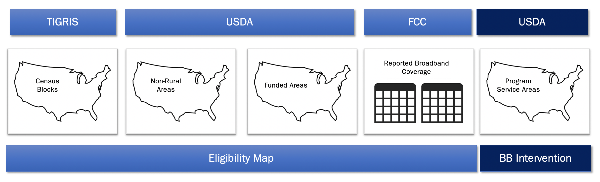

```{r, include=FALSE}
knitr::opts_chunk$set(
  eval=FALSE
)
```

------------------------------------------------------------------------


  

## FCC

[FCC Form 477 (2014 and 2018)]{.ul}

This dataset originally came as a zipped csv file posted to the FCC's data page for Form 477. Data was downloaded from FCC Form 477 website. The 2014 data uses version 3 of the zipped csv file posted online in December 2014. The 2018 data uses the file posted online in December 2018. Both files were downloaded via FTP, unzipped into a temporary file location and saved to the project folder in the script linked here: <>.

* Data Source: [FCC Form 477 Website](https://www.fcc.gov/general/broadband-deployment-data-fcc-form-477)
* Repo Location: [FCC Manipulation Code](https://github.com/uva-bi-sdad/rural_broadband/blob/dtmn_elig/src/eligibility/fcc_speed_data_load_manip.R)

## USDA

[USDA Non-Rural Areas 2010-2020]{.ul}

This dataset was posted to USDA's website of eligibility datasets. 

* Data Source: [USDA Eligibility Datasets](https://www.usda.gov/reconnect/eligibility-area-map-datasets)
* Repo Location: [Non-Rural Areas Translation Code](https://github.com/uva-bi-sdad/rural_broadband/blob/dtmn_elig/src/eligibility/usda_nonrural_areas_map_manip.Rmd)

[USDA Protected Borrowers]{.ul}

This dataset was posted to USDA's website of eligibility datasets. 

* Data Source: [USDA Eligibility Datasets](https://www.usda.gov/reconnect/eligibility-area-map-datasets)
* Repo Location: [Translating Prot Borr loc.34-39](https://github.com/uva-bi-sdad/rural_broadband/blob/dtmn_elig/src/eligibility/eligibilitymaps_18NOV2020.R)


[USDA CAF II Auction Spectrum]{.ul}

This dataset was posted to USDA's website of eligibility datasets. 

* Data Source: [USDA Eligibility Datasets](https://www.usda.gov/reconnect/eligibility-area-map-datasets)
* Repo Location: [Translating CAF II loc.40-43](https://github.com/uva-bi-sdad/rural_broadband/blob/dtmn_elig/src/eligibility/eligibilitymaps_18NOV2020.R)


[RUS Program Service Areas]{.ul}

MULTIPLE DATASETS 

* Data Source: Provided by USDA
* Repo Location: [xxx](https://github.com/uva-bi-sdad/rural_broadband/blob/dtmn_elig/src/eligibility/eligibilitymaps_18NOV2020.R)
