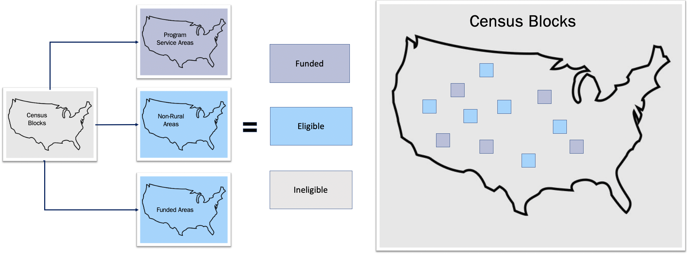

```{r, include=FALSE}
knitr::opts_chunk$set(
  eval=FALSE
)
```

------------------------------------------------------------------------

The data needed to be summarized to maximum coverage per block and compared against a threshold. 




